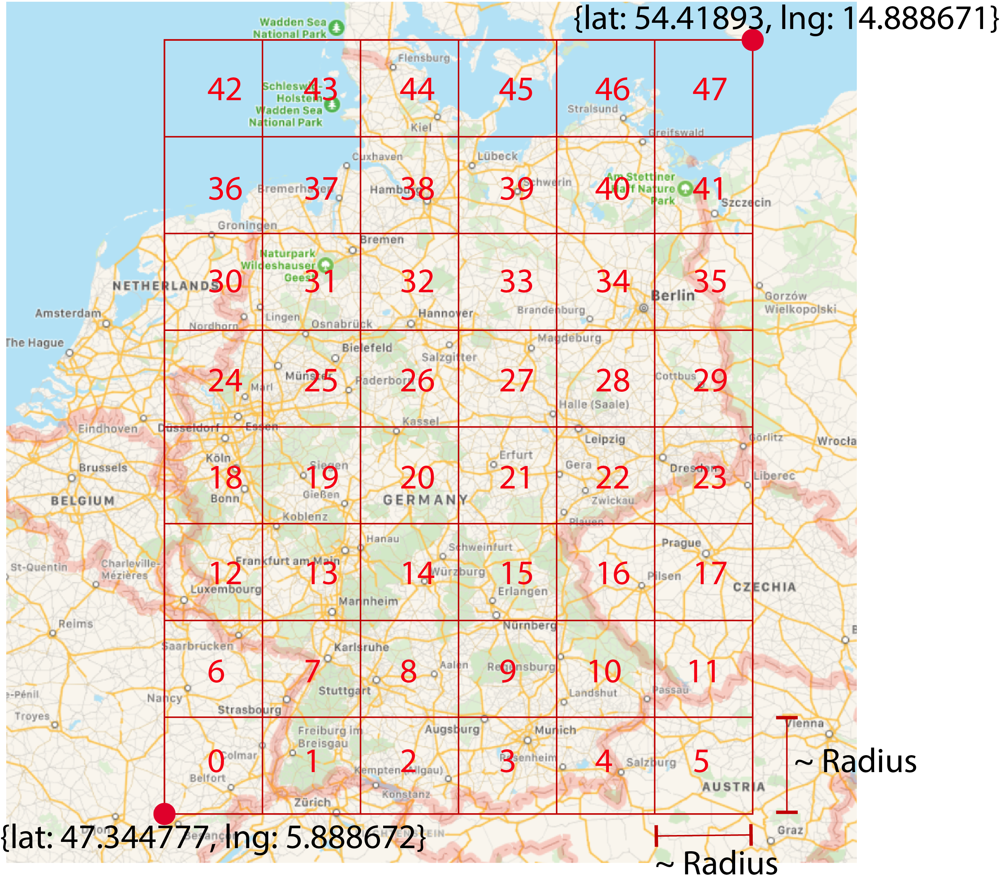
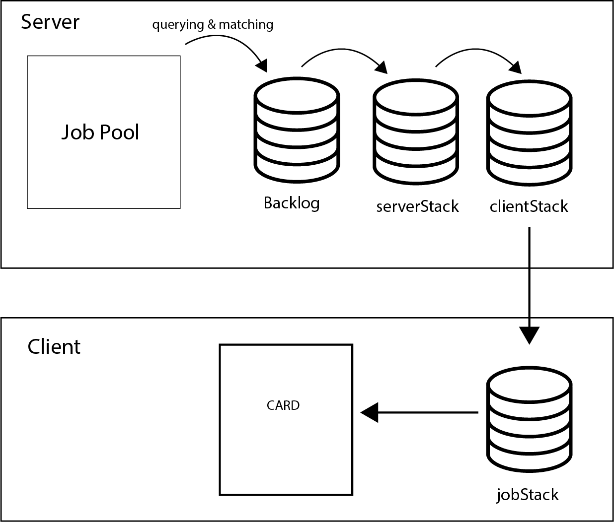

## jindr - your mobile job market
###### *GEN1003 Integrationsprojekt (Vertiefungsphase) - Sommersemester 2020*

> Supporting a young generation of pupils, students or trainees to
  find a part-time job - that's jindr's goal.
>
> As a job seeker you get the opportunity to quickly create a meaningful profile and
  deposit interests to explore suitable job offers.
>
> The registered employers get the opportunity to find motivated jobbers,
  beyond the old-fashioned mass and print media - directly accessible on their smartphone. Employers
  can actively search for jobbers, look at their profiles and get in touch with them or
  can alternatively be found through jinder's swiping system.  


## Members
* Leo Barnikol
* Pascal Block
* Julian Hermanspahn
* Valentin Laucht
* Lewe Lorenzen


## Live Versions
The staging branch can be found at ``https://jindr-staging.herokuapp.com``

The master branch can be found at ``https://jindr.herokuapp.com``


## Content
* [Featurelist](#featurelist)
* [Tools](#tools)
* [Prerequisites](#prerequisites)
* [Folder Structure](#folder-structure)
* [Client Documentation](#client-documentation)
* [Server Documentation](#server-documentation)
* [Pipelines and Deploy](#pipelines-and-deploy)
* [Emulate on Android](#emulate-on-android)
* [Database Controller](#database-controller)
* [Matching](#matching)
* [Job Stacks](#job-stacks)
* [Conclusion](#conclusion)


## Featurelist
| **methodical implementation**                          |
|--------------------------------------------------------|
| Jira                                                   |
| gitLab (package.json, directory structure, .gitignore) | 
| clean commits (traceability, naturalness)              |               
| SCRUM                                                  |
| selfmade structure                                     |
| CI / CD (Pipelines, jobs)                              |
| gitFlow (featurebranches, issues, Merge Requests)      |                                                                                                   


| **documentation**                                                                   |
|-------------------------------------------------------------------------------------|
| README.md (w/ graphics)                                                             |
| automatically generated documentations:                                             |
| apiDoc (server)                                                                     |
| Compodoc (client)                                                                   |
| Every text is written in english, as detailed as possible and refined extensively.  |


| **choice of technologies**                                                                          |
|-----------------------------------------------------------------------------------------------------|
| Every technology utilized is state of the art and has been used in the newest versions available.   |
| Angular in combination with Ionic to build a modern web app.                                        |
| Capacitor (instead of Cordova) as a cross-platform native runtime to generate a native Android app. |


| **architectural complexity / functionality**                                                                  |
|---------------------------------------------------------------------------------------------------------------|
|scaleability (cross platform development, responsive design, matching algorithm can handle large amount of data fast)                                                                               |
|runnability                                                                                                    |
|privacy policy                                                                                                 |
|impressum                                                                                                        |
|extreme functionality: swiping mechanism, location based services, chat, registration mail, password reset mail |


| **evaluation**                            |
|-------------------------------------------|
|conclusion of every team member            |
|automated testing                          |
|api tests (server)                         |
|Karma tests (client)                       |
|User Experience Test (w/ external persons) |


| **complexity of the organization**                     |
|--------------------------------------------------------|
| *media:*                                               |
| manual (flyer)                                         |
| scribbles                                              |
| high fidelity mockups,                                 |
| logo                                                   |
| content for Instagram & Facebook (w/ content plan)     |
| crossmedia strategy                                    |
| User Experience Test                                   |
|                                                        |
| *management:*                                          |
| analysis of competitors and target group (w/ personas) |
| PESTEL                                                 |
| SWOT                                                   |
| social contract                                        |
| morphological box                                      |


| **relenacy**                                                |         
|-------------------------------------------------------------|     
| used mechanics are very intuitive and fits the target group |     


| **quality of the final product**                                                                        |                             
|---------------------------------------------------------------------------------------------------------|     
| every promised functionality has been implemented                                                       |     
| can be used productively: app is hosted on a heroku server and can be deployed in the Google Play Store |     


| **team**                                                                                       |                             
|------------------------------------------------------------------------------------------------|     
| extremely high productivity thanks to the use of agile project management (daily scrum meeting) |                                                          
| regular communication via Zoom and BBB and active WhatsApp Group                                                         |
| extremely high team dynamic                                                                    |


## Tools
Tool | Usage
---------------------|----------
[Ionic](https://ionicframework.com/) | Frontend Development
[Node.js](https://nodejs.org/en/) | Server Development
[Express.js](https://expressjs.com/de/) | Server Development
[Nodemailer](https://nodemailer.com/about/) | Server Development
[Socket.io](https://socket.io/) | Client-Server Communication
[Capacitor](https://capacitor.ionicframework.com/) | Plugins and access to system resources
[AWS S3](https://aws.amazon.com/de/s3/) | Image storage
[MongoDB](https://www.mongodb.com/) | Database
[Mongoose](https://mongoosejs.com/) | MongoDB Framework
[GitLab](https://git.thm.de/) | Version Control
[Heroku](https://heroku.com/) | Hosting Platform
[Jest](https://jestjs.io/) | Server side testing
[GoogleMaps](https://cloud.google.com/maps-platform/maps?hl=de) | Map API
[GooglePlaces](https://cloud.google.com/maps-platform/places?hl=de) | Geocoding and reverse Geocoding
[apiDoc](https://apidocjs.com) | Server Documentation
[Compodoc](https://compodoc.app) | Client Documentation


## Prerequisites
Install Ionic CLI:
> npm install -g @ionic/cli

Install dependencies and compile:
>cd server && npm i && npm run tsc  <br>
>cd client && npm i

Install a local MongoDB Client and setup a database <br>
Find ``.env-example`` in server folder and rename to ``.env``.
Paste Path and URI of your MongoDB in ``MONGODB_NAME`` and ``MONGODB_URI``

Navigate to Server folder and run
> npm run start

Navigate to Client folder and run
> ionic serve


## Client Documentation
To review the client documentation, navigate to the Client folder and run
> npm run compodoc

Afterwards, open the link displayed in the terminal.


## Server Documentation
To review the server documentation, navigate to the Server folder and run
> npm run apidoc

Afterwards, navigate to ``server/apidoc`` and open the ``index.html`` file.


## Folder Structure
```bash
├── client
│   ├── interfaces
│   │   ├── *.ts (Classes)
│   ├── src
│   │   ├── app
│   │   │   ├── auth (all pages related to user authentication)
│   │   │   │   ├── auth.module.ts (modules and routing)
│   │   │   ├── landing (landing page)
│   │   │   ├── pages (all other pages, protected by AuthGuard)
│   │   │   ├── services (all services)
│   │   │   │   ├── DatabaseController (handles all API requests)
│   │   │   │   ├── storage.ts (handles local storage/ device storage)
│   │   │   ├── shared (all shared components)
│   │   │   ├── shell (shell models)
│   │   │   │   ├── e.g. text-shell (shows loading animation while real data is fetched)
│   │   ├── assets (all assets)
│   │   ├── environments (environment variables)
│   │   ├── sass (globally used sass helper files)
│   ├── package.json (client modules and scripts)
├── server
│   ├── server.ts (Server Script)
│   ├── package.json (Scripts and Modules for Server)
│   ├── .eslintrc (Config for ESLint)
│   ├── .eslintignore (Excluded files for ESLint)
│   ├── test
│   │   ├── database-handler.ts (Initializes Memory Database for tests)
│   │   ├── api.test.ts (Tests for API requests)
│   │   ├── function.test.ts (Tests for Method calls)
│   └── models
│   │   ├── *.ts (Mongoose Schemas)
├── .gitignore
├── .prettierrc (Config for Prettier)
├── jest.config.js (Config for Jest)
├── .env (Environment Variables)
├── .gitlab-ci.yml (Defines Deploy-Pipelines)
├── .package.json (Scripts for Deploy)
├── README.md
```


## Pipelines and Deploy
1. Before you start implementing functionalities, create a branch from ``staging``
and name it after the functionality you are going to implement.
2. Implement the functionality
3. Make sure to write tests and run them (Or write tests first for TDD)!
4. ``cd server && npm run prettier-format && npm run lint && npm run test``
5. Fix possible problems
6. ``cd client && npm run prettier-format && npm run lint && npm run karma && npm run build``
7. Fix possible problems
8. Commit and push and wait for pipelines to finish
9. Once everything is tested and works, make merge request to ``staging``


## Emulate on Android
1. Download [Android Studio](https://developer.android.com/studio/)
2. localhost (127.0.0.1) is your emulator not your local computer, so to access the node backend, you need to change
the environment file to point to ``apiUrl: 'http://10.0.2.2:8080'`` instead
3. If you get CORS issues, set ``ORIGIN_URL=http://localhost`` in your .env file
2. After making changes in the source code run ``npx cap copy``
3. Run ``npx cap open android`` to open android studio
4. Setup a device emulator in ``AVD Manager``
5. Run ``ionic capacitor run android`` to start in emulator

## Database Controller
All Database requests are handled by our generic database controller.
``src/app/services/DatabaseController``
The Database Controller has predefined methods for ``post, put`` and ``get`` requests. <br>
```js
         postRequest<T>(URL: string, data: string, type?: T): Promise<any> {
              return new Promise<any>((resolve, reject) => {
                  if (!this.isJsonData(data)) {
                  reject('Data is not valid JSON');
                 return;
                }
                 this.http.post(`${this.apiURL}/${URL}`, data, this.httpOptions).subscribe(
                 (res) => {
                     resolve(this.convert(res, type));
                    },
                    (error) => {
                      reject(error.error);
                    }
                );
                });
             }
```
This is the post request as example. The method can be called with 3 parameters. 
The URl is the URL of the requested server route, ``data`` is the data you wish to pass to the server as
valid JSON string, and ``type`` is a generic type of the data you expect to get back.
The method will first check if the passed data is valid JSON and then perform the post request. If a type has
been specified, the method will transform the received data to the requested type.
An example call could look like this:
```js
this.databaseController
        .postRequest('create-job', JSON.stringify({data}), Job)
        .then((res) => {
          this.job = res.data;
          resolve();
        })
        .catch((err) => {
          this.toastService.presentWarningToast(err.errors, err.message);
          reject(err);
        });
```
## Matching
If a User moves to another location or changes his search criteria, the server
must search for jobs to present to the user. To reduce the amount of jobs that need to
be searched on each request, the map will be rasterized. For now, this is only implemented for
Germany, but it's somewhat scalable. 

This is a simplified Version of a rasterized map of Germany.
<br> The Method ``rasterizeMap`` in ``server.ts`` will
take 2 Points specified by coordinates and a radius to rasterize the map
as shown in the image above.
The Points need to be the south-western and north-eastern point
of a rectangle around the area that needs to be rasterized. The Radius
will be the length of the sides of each tile. The radius should be the same as
the maximal search radius the user can choose in the app.
<br>
The method will then calculate the length of each side of the
outer rectangle and calculate how many tiles of the size of the radius can be build.
<br>
It will return an array of Tiles. Each Tile will look like this:

      public index: number;
      public neighbours: number[];
      public southWest: Coords;
      public northEast: Coords;

The Tile in the south-western corner will have Index 0, the Tile in the north-
eastern corner will have the index ``tiles.length - 1``.
The array ``neighbours`` will store the indexes of each tile next to it.

The Idea behind this is, that jobs don't move in position, once they are created. So if
a job is created, the coordinates of its position will be sent to the server. The server will look up the
correct tile and save its index in the job. 
<br> When a User looks for jobs, his coordinates will be sent to the server, the server will
look up in which tile the user is currently in and will get
all jobs from this tile and all neighboring tiles from the database and check
whether they are in the search radius specified by the user. Since the size of the tiles is the
maximum search radius, it will return all jobs that could possibly be in his radius.
<br> This drastically reduces the amount of jobs that need to be searched on each location change, since it ignores all jobs
that can't possibly be in his radius.

So in the example of Germany, the algorithm would create a raster of 208 tiles with roughly 50x50km.
So instead of looking for jobs in entire germany, it would only look up jobs in the same tile and in its at most
8 surrounding tiles (even less, if the tile is a border tile and has no neighbors in some directions).
This would reduce the amount of jobs that need to be searched by ~96%.


## Job Stacks
The aim is to continuously display jobs to the customer, while fetching new jobs seamlessly in the background.
To achieve this, the jobs are divided into different stacks.

The job pool consists of all jobs in the database, no matter if they match the
search criteria specified by the customer. If the user looks for jobs for the first time, the job stacks will be 
created. He will transmit his current location to the server and all jobs in the matching tiles will be queried 
and transferred to the backlog. 10 Jobs will then be moved to the clientStack and 10 to the serverStack. The
user will draw new jobs from the clientStack when he likes or dislikes a job. Only 3 jobs will be moved to the client at
once, to guarantee data integrity in case a job is edited or deleted. If the clientStack is smaller than 5, the
serverStack will be moved to the clientStack and new jobs from the backlog will be moved to the Serverstack.
If the user changes his position or search criteria, the backlog will be updated, but the user will always have
enough cards to swipe through without having to wait for the search to finish.


## Conclusion
#### Leo Barnikol

It's amazing what we've done in the past six weeks. The implementation of the idea was well supported with the help of the tools used.
It was an exciting project and I didn't think I could take so much out of it. The team dynamics were excellent and every 
team member contributed well. In conclusion, I am really happy to have been in such a team.


#### Pascal Block
Lorem Ipsum


#### Julian Hermanspahn
Working in a team worked very well despite the current situation. Through regular arrangements in daily scrum meetings
via Zoom or BBB, tasks could be clearly assigned to add them in Jira. The usage of CI / CD tools have helped
to create a professional product that has many interdisciplinary aspects. I am very satisfied with the overall 
process of the IP2 and would work with this team again at any time again.


#### Valentin Laucht
It was a fun and inspiring project, and I learned a lot. Especially regarding CI/CD, setting up test environments and
working on a bigger project as a team. The team worked well together and was always available to help each other or 
discuss different approaches for difficult solutions. Overall fortunately we ran in no bigger issues, except our
pipelines stopped working after the GIT update, one day before the project ended. 
I'm satisfied with the outcome of this project and enjoyed working with this team.


#### Lewe Lorenzen
Lorem Ipsum


